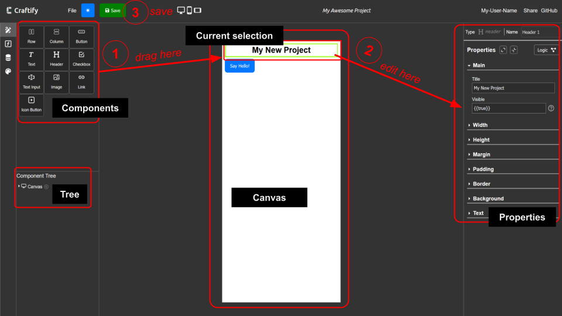

<a id="readme-top"></a>
<!--
*** Thanks to: Best-README-Template

-->


<!-- PROJECT SHIELDS -->

<div align="center">

<!-- [![Forks][forks-shield]][forks-url] -->
[![Contributors][contributors-shield]][contributors-url]
[![Stargazers][stars-shield]][stars-url]
[![Issues][issues-shield]][issues-url]
[![project_license][license-shield]][license-url]
[![LinkedIn][linkedin-shield]][linkedin-url]

</div>

<!-- PROJECT LOGO -->
<br />
<div align="center">
  <a href="https://github.com/franciscocgue/craftify2">
    
  </a>

<h3 align="center">Craftify</h3>

  <p align="center">
    The low-code Web Builder based on React and Node!
    <br />
    <!-- <a href="https://github.com/franciscocgue/craftify2"><strong>Explore the docs »</strong></a> -->
    <!-- <br /> -->
    <br />
    <a href="https://www.linkedin.com/feed/update/urn:li:activity:7297540478793633793/">View Demo</a>
    &middot;
    <a href="https://github.com/franciscocgue/craftify2/issues/new?labels=bug&template=bug-report---.md">Report Bug</a>
    &middot;
    <a href="https://github.com/franciscocgue/craftify2/issues/new?labels=enhancement&template=feature-request---.md">Request Feature</a>
  </p>
</div>


<!-- TABLE OF CONTENTS -->
<details>
  <summary>Table of Contents</summary>
  <ol>
    <li>
      <a href="#about-the-project">About The Project</a>
      <ul>
        <li><a href="#built-with">Built With</a></li>
      </ul>
    </li>
    <li>
      <a href="#getting-started">Getting Started</a>
      <ul>
        <li><a href="#prerequisites">Prerequisites</a></li>
        <li><a href="#installation">Installation</a></li>
      </ul>
    </li>
    <li><a href="#usage">Usage</a></li>
    <li><a href="#roadmap">Roadmap</a></li>
    <li><a href="#contributing">Contributing</a></li>
    <li><a href="#license">License</a></li>
    <li><a href="#contact">Contact</a></li>
  </ol>
</details>


<!-- ABOUT THE PROJECT -->
## About The Project

<a href="https://github.com/franciscocgue/craftify2">
    
</a>

</br>

What began as a _hobby project_ to learn and practice turned into... a hobby project 😄. But one that solves a problem: building web applications with no code.

Having used many of these low-code or no-code web builders, I thought it was time to build one, and learn how they work on the inside. 

That is why Craftify as a product is not the end goal here, but Craftify as an on-going project, where we can bring many tools together and see how they work with each other.

_Wait, what does that mean?_

Well, it means, Craftify is _extendable_. To give an example: you want to learn about Domain-Specific Language (DSL, for short), then you build it into the application. Want to use AWS S3 Buckets? Then why not. There is always a feature needing this or that.

A web builder is a great choice to implement virtually anything. Some other (randomly selected) examples could be:

* Jobs
* NoSQL Database
* Authentication
* APIs
* Building tools
* UX
* Testing
* Hosting
* React State Management

You name it!

That said, if you are also curious, feel free to take a peek 👀

<!-- [![Product Name Screen Shot][product-screenshot]](https://github.com/franciscocgue/craftify2) -->


<p align="right">(<a href="#readme-top">back to top</a>)</p>


### Built With

* [![Vite][Vite]][Vite-url]
* [![React][React.js]][React-url]
* [![Node][Node.js]][Node-url]

* [![Express][Express.js]][Express-url]
* [![MongoDB][MongoDB]][MongoDB-url]
* [![zustand][zustand]][zustand-url]
* [![Winston][Winston]][Winston-url]
* [![AWS][AWS]][AWS-url]
* [![dnd kit][dndkit]][dndkit-url]
* [![React Flow][reactflow]][reactflow-url]

<p align="right">(<a href="#readme-top">back to top</a>)</p>


<!-- GETTING STARTED -->
## Getting Started

Oops, this is still work in progress 😅

   ```sh
   @TODO: add steps to run the project locally, including docker container, config example / sample secrets, etc. Test =)
   ```

<!-- This is an example of how you may give instructions on setting up your project locally.
To get a local copy up and running follow these simple example steps.

### Prerequisites

This is an example of how to list things you need to use the software and how to install them.
* npm
  ```sh
  npm install npm@latest -g
  ```

### Installation

1. Get a free API Key at [https://example.com](https://example.com)
2. Clone the repo
   ```sh
   git clone https://github.com/franciscocgue/craftify2.git
   ```
3. Install NPM packages
   ```sh
   npm install
   ```
4. Enter your API in `config.js`
   ```js
   const API_KEY = 'ENTER YOUR API';
   ```
5. Change git remote url to avoid accidental pushes to base project
   ```sh
   git remote set-url origin franciscocgue/craftify2
   git remote -v # confirm the changes
   ``` -->

<p align="right">(<a href="#readme-top">back to top</a>)</p>


<!-- USAGE EXAMPLES -->
## Usage

   ```sh
   @TODO: the idea is to have some built-in help inside the application.

      For example, a tour or a carousel.

      Meanwhile, you can find here some screenshots with main functionality.
   ```

### Create Project


### Designer



<!-- Use this space to show useful examples of how a project can be used. Additional screenshots, code examples and demos work well in this space. You may also link to more resources. -->

<!-- _For more examples, please refer to the [Documentation](https://example.com)_ -->

<p align="right">(<a href="#readme-top">back to top</a>)</p>


<!-- ROADMAP -->
## Roadmap

This is not an exhaustive list—neither of completed features nor of those still to be done. The idea is to give a sense of the Done & To-Do items.

- [x] Drag and Drop functionality
- [x] Component Properties
- [x] Advanced Layout (flexbox-based)
- [x] Database to manage Projects
- [x] AWS S3 Bucket to serve built version
- [x] Node-based logic
- [x] Basic Variables
- [x] Domain-Specific-Language (DSL)
- [x] AWS S3 Bucket to serve built version
- [ ] More (advanced) components (e.g. Table, Charts)
- [ ] More logic functions (e.g. send email)
- [ ] Advanced Variables (arrays, objects)
    - [ ] Extend DSL
- [ ] Table management
    - [ ] Designer users can create tables (metadata-driven schema with wrapper)
    - [ ] CRUD functions to interact with tables from the Designer
- [ ] Authentication
- [ ] Code Coverage, Testing
- [ ] Documentation
    - [ ] Site
    - [ ] Carousel / Tour

See the [open issues](https://github.com/franciscocgue/craftify2/issues) for a full list of proposed features (and known issues).

<p align="right">(<a href="#readme-top">back to top</a>)</p>


<!-- CONTRIBUTING -->
## Contributing

Any contributions you make are **greatly appreciated** 🙌

If you have a suggestion that would make this better, please fork the repo and create a pull request. You can also simply open an issue with the tag "enhancement".
Don't forget to give the project a star! Thank you!

1. Fork the Project
2. Create your Feature Branch (`git checkout -b feature/AmazingFeature`)
3. Commit your Changes (`git commit -m 'Add some AmazingFeature'`)
4. Push to the Branch (`git push origin feature/AmazingFeature`)
5. Open a Pull Request

<p align="right">(<a href="#readme-top">back to top</a>)</p>

### Top contributors:

<a href="https://github.com/franciscocgue/craftify2/graphs/contributors">
  
</a>


<!-- LICENSE -->
## License

Distributed under the MIT. See `LICENSE.txt` for more information.

<p align="right">(<a href="#readme-top">back to top</a>)</p>


<!-- CONTACT -->
## Contact

Francisco Carmona Guerrero - [LinkedIn][linkedin-url] - franciscocguerrero@gmail.com

Project Link: [https://github.com/franciscocgue/craftify2](https://github.com/franciscocgue/craftify2)

<p align="right">(<a href="#readme-top">back to top</a>)</p>


<!-- MARKDOWN LINKS & IMAGES -->
<!-- https://www.markdownguide.org/basic-syntax/#reference-style-links -->
[contributors-shield]: https://img.shields.io/github/contributors/franciscocgue/craftify2.svg?style=for-the-badge
[contributors-url]: https://github.com/franciscocgue/craftify2/graphs/contributors
[forks-shield]: https://img.shields.io/github/forks/franciscocgue/craftify2.svg?style=for-the-badge
[forks-url]: https://github.com/franciscocgue/craftify2/network/members
[stars-shield]: https://img.shields.io/github/stars/franciscocgue/craftify2.svg?style=for-the-badge
[stars-url]: https://github.com/franciscocgue/craftify2/stargazers
[issues-shield]: https://img.shields.io/github/issues/franciscocgue/craftify2.svg?style=for-the-badge
[issues-url]: https://github.com/franciscocgue/craftify2/issues
[license-shield]: https://img.shields.io/github/license/franciscocgue/craftify2.svg?style=for-the-badge
[license-url]: https://github.com/franciscocgue/craftify2/blob/main/LICENSE.txt
[linkedin-shield]: https://img.shields.io/badge/-LinkedIn-black.svg?style=for-the-badge&logo=linkedin&colorB=555
[linkedin-url]: https://www.linkedin.com/in/francisco-carmona-guerrero-504773118/

[Vite]: https://img.shields.io/badge/Vite-35495E?style=for-the-badge&logo=vite&logoColor=646CFF
[Vite-url]: https://vite.dev/

[React.js]: https://img.shields.io/badge/React-232F3E?style=for-the-badge&logo=react&logoColor=61DAFB
[React-url]: https://reactjs.org/

[Node.js]: https://img.shields.io/badge/Node.JS-5FA04E?style=for-the-badge&logo=nodedotjs&logoColor=white
[Node-url]: https://nodejs.org/en

[Express.js]: https://img.shields.io/badge/Express.js-black?style=for-the-badge&logo=Express&logoColor=white
[Express-url]: https://expressjs.com/

[MongoDB]: https://img.shields.io/badge/MongoDB-47A248?style=for-the-badge&logo=MongoDB&logoColor=white
[MongoDB-url]: https://www.mongodb.com/

[zustand]: https://img.shields.io/badge/zustand-black?style=for-the-badge
[zustand-url]: https://github.com/pmndrs/zustand

[Winston]: https://img.shields.io/badge/Winston-black?style=for-the-badge
[Winston-url]: https://www.npmjs.com/package/winston

[AWS]: https://img.shields.io/badge/AWS-232F3E?style=for-the-badge&logo=amazonwebservices&logoColor=white
[AWS-url]: https://aws.amazon.com/es/sdk-for-javascript/

[dndkit]: https://img.shields.io/badge/dnd%20kit-black?style=for-the-badge
[dndkit-url]: https://dndkit.com/

[reactflow]: https://img.shields.io/badge/React%20Flow-1A192B?style=for-the-badge&logo=xyflow&logoColor=white
[reactflow-url]: https://reactflow.dev/
